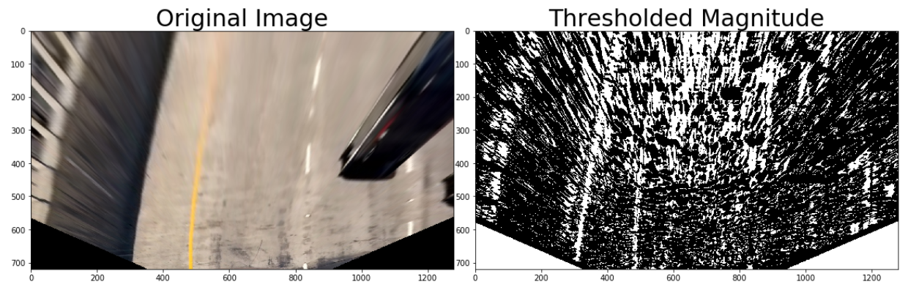

# Advanced Lane Detection
## Overview
Detect lanes using computer vision techniques. This project is part of the [Udacity Self-Driving Car Nanodegree](https://www.udacity.com/drive), and much of the code is leveraged from the lecture notes.

The following steps were performed for lane detection:

* Compute the camera calibration matrix and distortion coefficients given a set of chessboard images.
* Apply a distortion correction to raw images.
* Use color transforms, gradients, etc., to create a thresholded binary image.
* Apply a perspective transform to rectify binary image ("birds-eye view").
* Detect lane pixels and fit to find the lane boundary.
* Determine the curvature of the lane and vehicle position with respect to center.
* Warp the detected lane boundaries back onto the original image.
* Output visual display of the lane boundaries and numerical estimation of lane curvature and vehicle position.

## How to run
* Run `AdvancedLaneFindingProject.ipynb`
* Individual operations can be viewed inline in jupyter notebook
* project video will be generated at end and is apended as html video to view in jupyter notebook itself

To run the lane detector on arbitrary video files, update the last few lines of 'line_fit_video.py'.

## Camera calibration
The camera calibration was done using the chessboard images in './camera_cal/calibration*.jpg'. 
The following steps were performed for each calibration image:

* Read the image
* Convert image to grayscale
* Find chessboard corners with OpenCV's `cv2.findChessboardCorners`
* Draw chessboard corners with OpenCV's `cv2.drawChessboardCorners`
* objectpoints and imagepoints were stored for future reference
* Board was assumed to be 9*6

After the above steps were executed for all calibration images: 
* `undistort()` method is used that lies in  `AdvancedLaneFindingProject.ipynb`
* distortion matrices were calculated using `cv2.calibrateCamera`
* undistort image using `cv1.undistort`

Here is the actual image undistorted via camera calibration:

### Prespective transform
* `prespectiveTransform()` method is used that lies in  `AdvancedLaneFindingProject.ipynb`
* Given the thresholded binary image, the next step is to perform a perspective transform. The goal is to transform the image such that we get a "bird's eye view" of the lane, which enables us to fit a curved line to the lane lines (e.g. polynomial fit). Another thing this accomplishes is to "crop" an area of the original image that is most likely to have the lane line pixels.

* To accomplish the perspective transform, I use OpenCV's `getPerspectiveTransform()` and `warpPerspective()` functions

Here is the example image, after applying perspective transform:

### Sobel Gradient Magnitude Threshold
* Next step was to calculate sobel gradient magnitude threshhold
* `mag_thresh()` method is used that lies in  `AdvancedLaneFindingProject.ipynb`
* A function that applies Sobel x and y, then computes the magnitude of the gradient and applies a threshold
* sobel_kernel was defaulted to 3 and mag_thresh to (20,255)
* `cv2.sobel()` was used to calculate sobel gradient

Here is the output from above process:

### Sobel Gradient Direction Threshold
* Next step was to calculate sobel gradient direction threshhold
* `dir_threshold()` method is used that lies in  `AdvancedLaneFindingProject.ipynb`
* A function that applies Sobel x and y, then computes the direction of the gradient and applies a threshold
* sobel_kernel was defaulted to 15 and thresh to (0,0.1)
* `cv2.sobel()` was used to calculate sobel gradient
* `np.arctan2(abs_sobely, abs_sobelx)` is used to calculate the direction of the gradient 

Here is the output from above process:

### combined sobel output

### color threshholds
* I ran a image through various threshold color values and found that
* LAB B-channel and HLS S-channel was best fit
* added two methods `lab_bthresh()` and `hls_lthresh()` to do same

### Threshold binary image
* The next step was to connect all the previous operations to create a threshold binary image
* following steps were performed for pipeline:
  * undistort()
  * prespectiveTransform()
  * mag_thresh()
  * dir_threshold()
  * img_lthresh()
  * img_bthresh()
  * combined the sobel and color threshold to generate final binary image
  * All the operation performed are already explained above
* Below is the ouput of pipeline

### Implement Sliding Windows and Fit a Polynomial
Given the output image from the previous step, I now fit a 2nd order polynomial to both left and right lane lines. 

* The first step i took is to split the histogram into two sides, one for each lane line.
* next step is to set a few hyperparameters related to our sliding windows, and set them up to iterate across the binary activations in   the image
* Now that I've set up what the windows look like and have a starting point, loop for nwindows, with the given window sliding left or right if it finds the mean position of activated pixels within the window to have shifted
* steps performed were:
  * Loop through each window in nwindows
  * Find the boundaries of our current window. This is based on a combination of the current window's starting point (leftx_current and rightx_current), as well as the margin set in the hyperparameters.
  * Now that I knew the boundaries of our window, find out which activated pixels from nonzeroy and nonzerox above actually fall into the window.
  * Append these to our lists left_lane_inds and right_lane_inds.
  * If the number of pixels you found in Step 4 are greater than your hyperparameter minpix, re-center our window (i.e. leftx_current or rightx_current) based on the mean position of these pixels.

### fit_polynomial
Now that we have found all our pixels belonging to each line through the sliding window method, it's time to fit a polynomial to the line.
* `prev_fit()` method is used that lies in  `AdvancedLaneFindingProject.ipynb`

### Radius of curvature
Given the polynomial fit for the left and right lane lines, I calculated the radius of curvature for each line.
I also converted the distance units from pixels to meters, assuming 30 meters per 720 pixels in the vertical direction, and 3.7 meters per 700 pixels in the horizontal direction.

Finally, I averaged the radius of curvature for the left and right lane lines.

The code to calculate the radius of curvature is in the function `calculateCurveRadius()` in 'AdvancedLaneFindingProject.ipynb'.

### Vehicle offset from lane center
* Given the polynomial fit for the left and right lane lines, I calculated the vehicle's offset from the lane center. 
* To calculate the vehicle's offset from the center of the lane line, I assumed the vehicle's center is the center of the image 
* calculated the lane's center as the mean x value of the bottom x value of the left lane line, and bottom x value of the right lane line. 
* The offset is simply the  car_position - lane_center_position.

The code to calculate the vehicle's lane offset is in the function `centreDaviation()` in 'AdvancedLaneFindingProject.ipynb'.

### Visualize output
* Finally i added two methods `draw_lane()` and `plotdata()`  in 'AdvancedLaneFindingProject.ipynb' for visualising the result.
* `draw_lane()`  performs following steps:
  * Create an image to draw the lines on
  * Recast the x and y points into usable format for cv2.fillPoly()
  * Draw the lane onto the warped blank image
  * Warp the blank back to original image space using inverse perspective matrix (Minv)
  * Combine the result with the original image
  * return result
* `plotdata()`  plots the `radius of curvature` and `vehicle offset` from center

### Line class is used to receive the characteristics of each line detection

### `advancedLaneDetection()` is used to perform following steps:
 * if both left and right lines were detected last frame, use prev_fit, otherwise use sliding window
 * invalidate both fits if the difference in their x-intercepts isn't around 350 px (+/- 100 px)
 * draw the current best fit if it exists

### Finally ran pipeline through all the images and also through project video . The output can be found inline in `AdvancedLaneFindingProject.ipynb` notebook

## Discussion
This is an initial version of advanced computer-vision-based lane finding. 
There are a lot of improvements that can still be done.
* This doesn't work in case of there are lane crossing on road
* Also shadows and other factors on road woud affect lane detection
* This would also fail at sharp corners.
* A better approach would be using deeplearning to identify lane lines.

